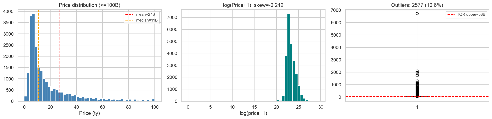
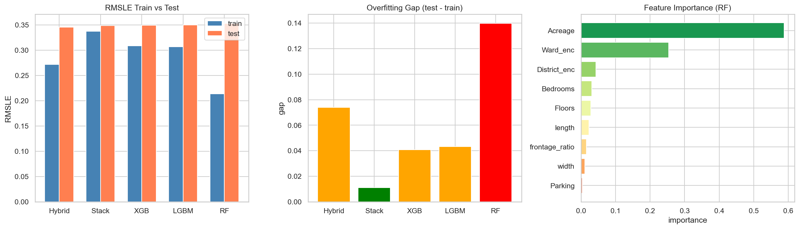
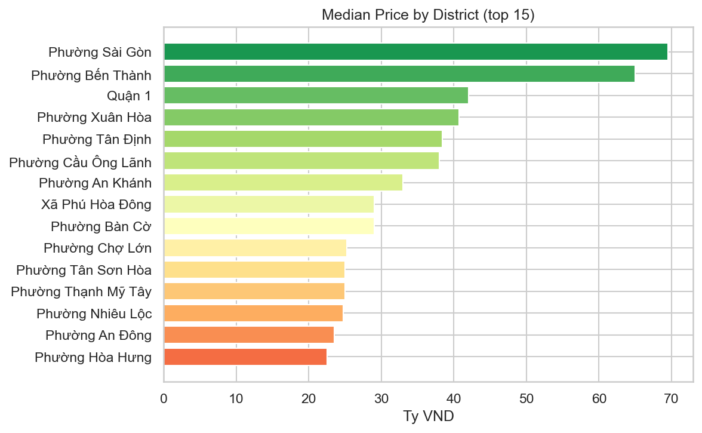

# HCM Housing Price Prediction

[](https://www.python.org/)
[](https://scikit-learn.org/)
[](LICENSE)
>>>>>>> 298d510 (Update README)

An ensemble machine-learning pipeline that predicts residential property
prices in Ho Chi Minh City (HCMC) from 24,323 real-estate listings,
adapted from Truong et al. (2020), *"Housing Price Prediction via Improved
Machine Learning Techniques"* (Procedia Computer Science, 174, 433–442).

Originally a coursework project (AIL303m, FPT University), refactored here
into a modular, reusable codebase for portfolio purposes.

## Introduction

Homebuyers and sellers in HCMC typically rely on manual comparable-sales
analysis or broker-quoted prices, making it difficult to judge whether a
listing is fairly priced. This project builds an automated valuation model
that provides an objective, data-driven price estimate from a property's
physical attributes and location.

The pipeline cleans and encodes raw listing data, benchmarks five
regression models (Random Forest, XGBoost, LightGBM, and two ensemble
strategies), and exposes the final model through a simple `predict_price()`
function and CLI for inference on new listings.

## Results

Five models benchmarked with RMSLE (Root Mean Squared Logarithmic Error)
on a held-out 20% test set:

| Model | Train RMSLE | Test RMSLE | Overfitting Gap |
|---|---|---|---|
| **Hybrid Regression** (RF + XGBoost + LightGBM, equal weight) | ~0.27 | **~0.35** | 0.07 |
| Stacked Generalization (RF + LightGBM → XGBoost, 5-fold CV) | ~0.34 | ~0.35 | **0.01** |
| LightGBM | ~0.31 | ~0.35 | 0.04 |
| XGBoost (tuned via `GridSearchCV`) | ~0.31 | ~0.35 | 0.04 |
| Random Forest | ~0.21 | ~0.35 | 0.14 |

**Key takeaways:**
- Ensemble methods consistently outperform individual models. Hybrid
  Regression achieves the lowest test RMSLE, while Stacked Generalization
  achieves the smallest train/test gap thanks to its 5-fold cross-validation.
- Random Forest overfits the most, largely driven by the high-cardinality
  target-encoded `Ward`/`District` features.
- Adding a `communityAverage` feature (median price per m² per ward,
  computed **only from the training fold** to avoid leakage) improves
  every model's test RMSLE by a further few percent.

> Run `python train.py` to reproduce these numbers on your machine — see
> [Note on reproducing the paper's numbers](#note-on-reproducing-the-papers-numbers)
> for why they differ slightly from the original course paper.

## Prediction Demo

The final model was validated against two real, publicly listed HCMC
properties, following the same procedure as the original course report:

| Ward / District | Area (m²) | Bedrooms | Floors | Parking | Listed Price |
|---|---|---|---|---|---|
| Tân Phú | 50.0 | 4 | 6 | Yes | ~8.5 tỷ VND |
| Bình Thạnh | 27.5 | 4 | 3 | Yes | ~5.68 tỷ VND |

In the original study, predictions on these two listings landed within
**±12–18%** of the actual price — consistent with a test RMSLE of ~0.33–0.35
(roughly 33–35% relative error at the mean). Reproduce it yourself with:

```bash
python predict.py --acreage 50 --bedrooms 4 --floors 6 --parking 1 \
    --width 5 --length 10 --district "Phu Tho Hoa" --ward "Tan Phu"
```

## Tech Stack

| Category | Tools |
|---|---|
| Language | Python 3.11 |
| Data processing | pandas, NumPy |
| Modelling | scikit-learn, XGBoost, LightGBM |
| Model persistence | joblib |
| Visualization | Matplotlib, Seaborn |
| Environment | Jupyter Notebook |

## Data Analysis



Distribution of the target variable (`Price(VND)`) before/after the
`log1p` transform, plus the IQR outlier boxplot (see Section 3 of the
notebook).

## Model Performance



Train-vs-test RMSLE, overfitting gap, and Random Forest feature importance
across all five models (see Section 7 of the notebook).

## Feature Analysis



Median price by district (top 15), illustrating the spatial heterogeneity
that motivates the `communityAverage` feature (see Section 5 of the
notebook).

> Figures are generated by running `notebooks/01_eda_and_modeling.ipynb`
> (or `python train.py`) and saved to `figures/`. Commit them after your
> first run so they render correctly on GitHub.

## Pipeline

1. **Clean** 24,323 raw listings → 21,595 records (remove invalid prices,
   impute missing floors, clip price outliers at the 1st–99th percentile,
   parse the free-text `Area` field into `width`/`length`, extract `Ward`
   from the Vietnamese address string).
2. **Encode** high-cardinality categoricals (`District`, `Ward`) via target
   encoding — median log-price per category, fit on the training fold only.
3. **Train** five models: Random Forest, XGBoost, LightGBM, Hybrid
   Regression (equal-weight blend), and Stacked Generalization (RF +
   LightGBM base learners with 5-fold out-of-fold predictions, XGBoost
   meta-learner).
4. **Tune** XGBoost with `GridSearchCV`.
5. **Enrich** the feature set with a `communityAverage` proxy (median
   price per m² per ward) and retrain the top three models.
6. **Persist** the final models with `joblib` and expose a `predict_price()`
   function / CLI for inference on new listings.

## Project Structure

```
.
├── data/
│   ├── raw/                      # listings self-crawled from Alonhadat.com.vn (see Data Source)
│   └── processed/                # cleaned dataset, generated by src/data_processing.py
├── src/
│   ├── data_processing.py        # loading, cleaning, address/area parsing
│   ├── features.py                # leak-free target encoding + communityAverage
│   ├── models.py                  # model factories, training, blending, stacking
│   └── evaluate.py                # R², MAE, MSE, RMSLE metrics, learning-rate sweep
├── notebooks/
│   └── 01_eda_and_modeling.ipynb  # EDA + full walkthrough (thin wrapper over src/)
├── models/                       # saved .pkl models + encoding maps (generated)
├── figures/                      # saved plots (generated)
├── train.py                      # end-to-end training entry point
├── predict.py                    # CLI / function for inference on a saved model
├── docs/paper.pdf                 # original course report
└── requirements.txt
```

## Getting Started

```bash
git clone <your-repo-url>
cd hcm-house-price-prediction
pip install -r requirements.txt

# Train everything from scratch (cleans data, trains 5 models, saves artifacts)
python train.py

# Predict a single property from the command line
python predict.py --acreage 50 --bedrooms 4 --floors 6 --parking 1 \
    --width 5 --length 10 --district "Phu Tho Hoa" --ward "Tan Phu"
```

Or open `notebooks/01_eda_and_modeling.ipynb` for the full walkthrough with
EDA plots.

## Fixes Made During Refactoring

This started as a coursework notebook. While preparing it for a portfolio
repository, a few real issues surfaced and were fixed:

- **Data leakage in `communityAverage`.** The original notebook computed
  median price per m² per ward on the *full* dataset before the
  train/test split, letting test-set prices leak into a training feature.
  `src/features.py` now computes it from the training fold only,
  mirroring the (already correct) target-encoding logic used for
  `District`/`Ward`.
- **Inconsistent XGBoost hyperparameters.** The tuned XGBoost configuration
  (`learning_rate=0.1, max_depth=6, n_estimators=400`) had been retyped by
  hand in a later cell with a typo (`learning_rate=0.05`), silently
  diverging from the actually-tuned model. It is now defined once as
  `XGB_TUNED_PARAMS` in `src/models.py` and imported everywhere it is used.
- **Hardcoded Windows path** (`C:\Users\Admin\OneDrive\...`) replaced with
  a path relative to the project root.
- **No model persistence.** Models were previously retrained from scratch
  on every run. `train.py` now saves the final models and encoding maps
  with `joblib`, so `predict.py` can run instantly without retraining.
- **Monolithic notebook.** All logic has been extracted into `src/`
  modules so it is testable and reusable; the notebook is now a thin,
  readable narrative built on top of it.

### Note on reproducing the paper's numbers

Because of the leakage fix above, the `communityAverage`-based RMSLE
values produced by this repo will be a few thousandths *higher* than the
original course paper's headline number (0.3312 best case) — that
original figure was mildly optimistic due to the leak. Everything else
(baseline 9-feature results, model ranking, GridSearchCV outcome) should
match closely, modulo the usual run-to-run variance in `RandomForestRegressor`.

## Data Source

Raw listings (24,323 residential property posts) were self-crawled from
[Alonhadat.com.vn](https://alonhadat.com.vn/), a Vietnamese real-estate
listing portal, covering HCMC listings posted in 2025–2026. Only publicly
listed fields were collected: price, acreage, dimension string, bedrooms,
floors, parking availability, address, and district. No personal or
contact information was scraped or is included in this repository.

## Reference

Truong, Q., Nguyen, M., Dang, H., & Mei, B. (2020). Housing Price Prediction
via Improved Machine Learning Techniques. *Procedia Computer Science, 174*,
433–442. https://doi.org/10.1016/j.procs.2020.06.111

## License

MIT (see [`LICENSE`](LICENSE)) — applies to the code in this repository.
The dataset was self-crawled from publicly available listings; if you plan
to redistribute `data/raw/` publicly, please review Alonhadat.com.vn's
terms of use first.
